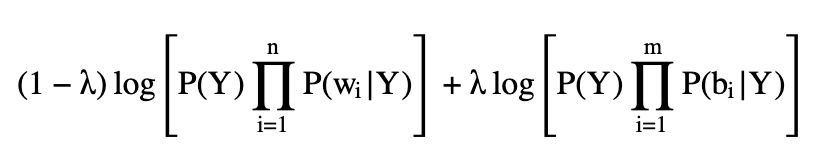

# artificial-intelligence
The projects are written in python3 and while the core functionalities have been written by myself the templates and the environment have been configured by and originated from University of Illinois at Urbana-Champaign. 

## Search
requires python3, pygame, numpy

In .search.py,
def bfs(maze):
def astar_single(maze):
def astar_multiple(maze):
def fast(maze):

This project aims to solve mazes by using different search algorithms
1. Breadth-first search, with one waypoint.
2. A* search, with one waypoint.
3. A* search, with many waypoints.
4. Faster A* search, with many waypoints

The _data_/ directory contains the maze files. Each maze is a simple plaintext file. 

The main.py file is the primary entry point and with 

**python3 main.py --human data/part-1/small** 

it will open a pygame-based interactive visualization of the _data/part-1/small_ maze. 

The blue dot represents the agent. agent can be moved using the arrow keys. The black dots represent the maze waypoints. The agent has to go through a path that reaches all of the waypoints.

you can run and test the algorithms by **python3 main.py "path to maze file" --search "search algorithm name[bfs, astar_single, astar_multiple, fast]"**

## Naive Bayes
requires python3, pygame, numpy, nltk, scikit-learn

In naive_bayes.py,
def naiveBayes():
def bigramBayes():

Given a dataset containing positive and negative reviews, this project uses a Naive Bayes classifier that will predict the right class label given an unseen review. 

**Dataset**

The data set consists of 10,000 positive and 3,000 negative reviews, a subset of the [Stanford Movie Review Dataset](https://ai.stanford.edu/~amaas/data/sentiment/), which was originally introduced by [this paper.](https://aclanthology.org/P11-1015/) The data in split into 5,000 development examples and 8,000 training examples. 

**Unigram Model**

The bag of words model in NLP is a simple unigram model which considers a text to be represented as a bag of independent words.

so, the probability of a review being positive given the words in the review. estimated the posterior probabilities and returned the type label with the higher priority. Log probabilities are used to avoid underflow.

**Bigram Model**

Unigram assumes that every word is independent which often does not provide accurate predictions in the real world. Instead, Bigram model processes every two adjacent words together.

we set up the posterior probabilities just as the unigram model into a mixture model defined with a parameter $\lambda$.

we need to find the best parameter $\lambda$ that gives the highest classification accuracy.

run **python3 main.py -h** for information on how to run. 

## HMM POS tagging

baseline.py
viterbi_1.py
viterbi_2.py
viterbi_3.py

The code reads data from two files. THe tagging functions are given the training data with tags and the test data without tags. The tagger tnen infer tags for the test data input. THe main.py function will compare these against the correct tags and report accuracy.

__Training and development data__

Brown corpus: data/brown-training.txt, data/brown-dev.txt

__Running the code__
The code converts all words to lowercase. It also adds a START and END tag for each sentence when it loads the sentence. These tags are just for standardization. They will not be considered in accuracy computation.

To run the code on the Brown corpus data you need to tell it where the data is and which algorithm to run, either baseline, viterbi_1, viterbi_2, or viterbi_3:

python3 main.py --train data/brown-training.txt --test data/brown-dev.txt --algorithm [baseline, viterbi_1, viterbi_2, viterbi_3]

The program will run the algorithm and report three accuracy numbers:

1. overall accuracy
2. accuracy on words that have been seen with multiple different tags
3. accuracy on unseen words

__Tagset__

The following is an example set of 16 part of speech tags. This is the tagset used in the provided Brown corpus.

* ADJ adjective
* ADV adverb
* IN preposition
* PART particle (e.g. after verb, looks like a preposition)
* PRON pronoun
* NUM number
* CONJ conjunction
* UH filler, exclamation
* TO infinitive
* VERB verb
* MODAL modal verb
* DET determiner
* NOUN noun
* PERIOD end of sentence punctuation
* PUNCT other punctuation
* X miscellaneous hard-to-classify items

__Baseline tagger__

The Baseline tagger considers each word independently, ignoring previous words and tags. For each word w, it counts how many times w occurs with each tag in the training data. When processing the test data, it consistently gives w the tag that was seen most often. For unseen words, it should guess the tag that's seen the most often in training dataset.

A correctly working baseline tagger should get about 93.9% accuracy on the Brown corpus development set, with over 90% accuracy on multitag words and over 69% on unseen words.

__Viterbi_1__

The Viterbi tagger implements the HMM trellis (Viterbi) decoding algoirthm. That is, the probability of each tag depends only on the previous tag, and the probability of each word depends only on the corresponding tag. This model will need to estimate three sets of probabilities:

* Initial probabilities (How often does each tag occur at the start of a sentence?)
* Transition probabilities (How often does tag t_b follow tag t_a?)
* Emission probabilities (How often does tag t yield word w?)

1. count occurrences of tags, tag pairs, tag/word pairs.
2. Compute smoothed probabilities
3. Take the log of each probability
4. Construct the trellis. 
5. Return the best path through the trellis.

This simple version of Viterbi will perform worse than the baseline code for the Brown development dataset (somewhat over 93% accuracy). However you should notice that it's doing better on the multiple-tag words (e.g. over 93.5%). 

__Viterbi_2__

The previous Vitebi tagger fails to beat the baseline because it does very poorly on unseen words. It's assuming that all tags have similar probability for these words, but we know that a new word is much more likely to have the tag NOUN than (say) CONJ. Viterbi_2 improve upon the emission smoothing to match the real probabilities for unseen words.

Words that occur only once in the training data ("hapax" words) have a distribution similar to the words that appear only in the test/development data. It extracts these words from the training data and calculate the probability of each tag on them. For Laplace smoothing of the emission probabilities for tag T, it scales Laplace smoothing constant by the corresponding probability of tag T occurs among the set hapax words.

This optimized version of the Viterbi code should have a significantly better unseen word accuracy on the Brown development dataset, e.g. over 66.5%. It also beat the baseline on overall accuracy (e.g. 95.5%). 

## Classification

requires numpy

In ./classify.py,
def trainPerceptron():
def classifyPerceptron():
def classifyKNN():

This project aims to classify which images have animals in them using two different classification algorithms. Using the given training set, .classify.py will train a perceptron and K-nearest neighbor to predict the right class label for an unseen image.

**Dataset (animal_dataset)**

The dataset consists of 10,000 32x32 colored images total, which is a subset of the CIFAR_10 dataset, provided by Alex Krizhevsky. The dataset is split into 2500 development and 7500 training examples. (Images have their RGB values scaled to range 0 - 1)

**Perceptron Model**

The perceptron model is a linear function that tries to separate data into two or more classes with a set of weights wi, bias *b* and features x1,...,xn.

The perceptron learning algorithm in def trainPerceptron(): will find good weight paramenters wi, and bias *b* such that sign(fw,b(x)) > 0 when there is an animal in the image and sign(fw,b(x)) < 0 when there is not. (The images are 32x32 and has three RGB color channels which yields 32x32x3 = 3,072 features.)

**K-nearest neighbors Model**

k-NN is a type of classification where the function only classifies locally and all computation is deferred until evaluation. it uses euclidean distance and looks at user-defined k nearest neighbors to determine whether there is an animal in the image or not. when there is a tie, the negative label is assigned. (no animal class)

[K-Nearest Neighbors wikipedia](https://ai.stanford.edu/~amaas/data/sentiment/)

**Running the code**

In classification directory, 

"python3 main.py --h"